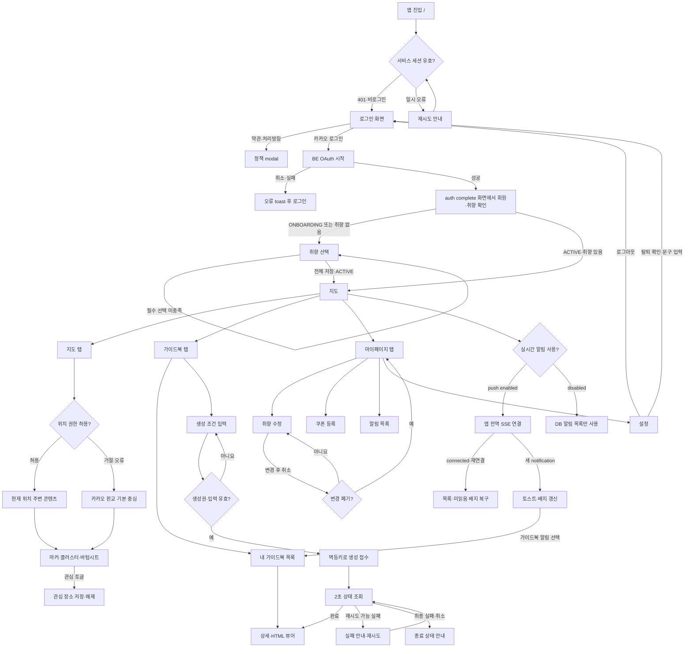

# V1 유저 플로우

## 1. 전체 흐름

## 2. 주요 판단 지점

### 로그인과 회원 상태

- `/`에서 `/members/me`가 401이면 로그인 화면을 표시한다. 로그인되지 않은 첫 진입의 401은 세션 존재 여부 확인 결과이므로 만료 toast를 띄우지 않는다.
- 보호 화면에서 백그라운드 재검증이 401이면 `다시 로그인해 주세요.` 안내 후 로그인 화면으로 이동한다.
- `ONBOARDING`이거나 저장한 취향이 없으면 `/preferences`, `ACTIVE`이고 취향이 있으면 `/map`으로 이동한다.
- 보호 페이지 이동은 캐시된 ACTIVE 회원으로 즉시 표시하되 서버 재검증은 계속한다.

### 취향 입력과 수정

- 최초 입력은 필수 THEME·DETAIL 선택을 충족해야 다음 버튼이 활성화된다.
- 마이페이지에서 들어오면 저장된 선택을 보여주고 취소·저장 동작을 제공한다.
- 수정 내용이 있는데 취소하면 폐기 확인 modal을 거친다.

### 지도

- 브라우저 위치 권한이 없으면 화면이 멈추지 않고 카카오 판교 아지트를 기본 중심으로 사용한다.
- 지도 viewport와 zoom에 따라 서버가 콘텐츠 또는 클러스터를 반환한다.
- 마커 선택은 바텀시트로 이어지고 관심 장소 변경은 로그인 세션과 CSRF가 필요하다.

### 가이드북 생성

- 입력 검증과 생성권 확인을 모두 통과해야 생성 요청을 보낸다.
- 중복 클릭은 버튼 상태와 `Idempotency-Key`로 방지한다.
- 생성 상태 조회는 화면 이동 후에도 전역 provider에서 유지되고 종료 상태, 오류, 로그아웃에서 정리한다.
- 완료하면 목록·상세로 이동할 수 있고 알림 목록의 미읽음 수를 다시 조회한다.

### 로그아웃과 탈퇴

- 로그아웃은 확인 modal 뒤 현재 서비스 세션을 폐기한다.
- 탈퇴는 안내 확인, checkbox, `회원 탈퇴` 문구 입력을 순서대로 통과해야 요청할 수 있다.
- 성공하면 인증·CSRF 메모리 상태를 지우고 로그인 화면으로 이동한다.
- 로그아웃과 탈퇴가 성공하면 앱 전역 EventSource를 닫아 자동 재연결을 막는다.

### 실시간 인앱 알림

- 페이지마다 연결하지 않고 앱 전역 `NotificationCenter`에서 회원당 한 개의 EventSource를 유지한다.
- `connected` 이벤트는 사용자 알림으로 표시하지 않고, 연결·재연결 시 목록과 미읽음 배지만 동기화한다.
- 토스트는 SSE로 새로 도착한 `notification` 이벤트에만 표시하며 과거 목록 조회 결과로 재생하지 않는다.
- 가이드북 완료 토스트를 선택하면 읽음 처리 후 목록으로 이동하고 대상 가이드북을 잠시 강조한다.
- SSE가 끊긴 동안의 알림은 서버 알림 목록을 기준으로 복구한다.

### 백그라운드 Web Push

- 열린 앱에 SSE 전송이 성공하면 BE가 동일 알림의 Web Push를 생략한다. 연결이 없거나 SSE 전송이 실패하면 Web Push로 fallback한다.
- Service Worker는 `notification_id`, `type`, `reference_type`, `reference_id`를 검증하고 가이드북 완료 시스템 알림을 표시한다.
- 시스템 알림을 선택하면 열린 동일 origin 창을 우선 재사용하고, 창이 없을 때만 새 창을 열어 가이드북 목록의 대상 카드를 강조한다.
- SSE와 Push가 경합할 수 있으므로 `notification_id`를 페이지와 Service Worker 사이에 공유해 토스트·시스템 알림 중복을 best-effort로 억제한다.
- 모션 감소 설정에서는 흔들림 없이 테두리와 그림자로 대상 카드를 구분한다.

## 3. 화면에 필요한 공통 상태

| 상태 | 화면 원칙 |
| --- | --- |
| Loading | 중복 조작을 막되 보호 페이지 이동마다 전체 화면을 가리지 않는다. |
| Empty | 정상적인 결과 없음과 오류를 구분해 다음 행동을 제시한다. |
| Error | 사용자 문구와 가능한 경우 재시도 동작을 제공한다. |
| Unauthorized | 첫 비로그인 확인과 사용 중 세션 만료를 구분한다. |
| Submitting | 버튼을 비활성화하고 같은 요청의 중복 제출을 방지한다. |

이 흐름은 컴포넌트와 API 연동의 기초다. 새 화면은 진입 조건, 사용자 액션, 분기, 필요한 API와 종료 상태를 먼저 이 문서에 연결한다.
