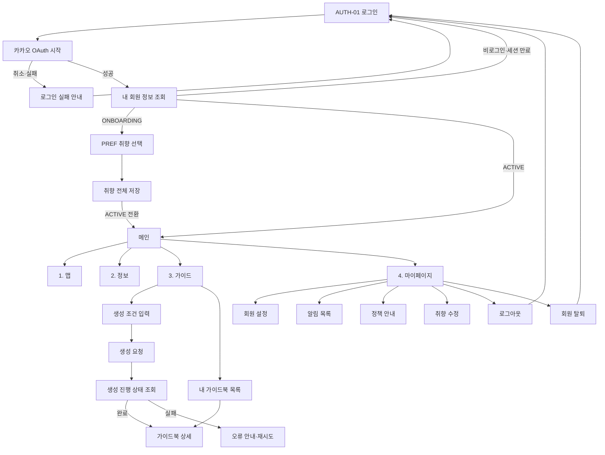

# V1 유저 플로우 차트

> Figma `10팀_Figma`의 V1 프레임에서 확인한 로그인, 취향 선택, 맵·정보·가이드·마이페이지 흐름을 기준으로 작성했다.

## 화면 공통 상태

- 최초 진입: 세션 확인 전 로딩 화면을 표시한다.
- API 진행: 중복 제출을 막고 진행 상태를 표시한다.
- 실패: 사용자가 이해할 문구와 가능한 경우 재시도 동작을 제공한다.
- 빈 결과: 오류와 구분되는 빈 상태 화면을 제공한다.

## 추후 구체화

- 맵·정보 화면의 검색, 필터, 마커 상세 이동
- 가이드북 생성 단계별 진행률과 취소 가능 시점
- Figma 페이지 ID와 실제 URL의 1:1 대응표
